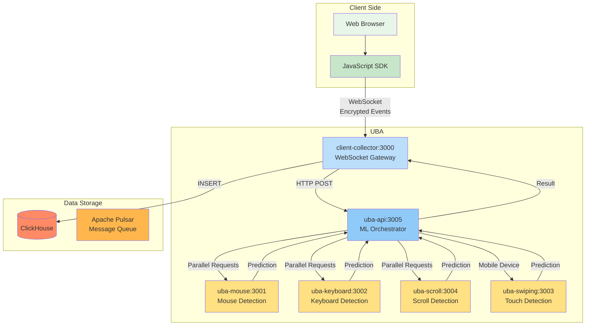
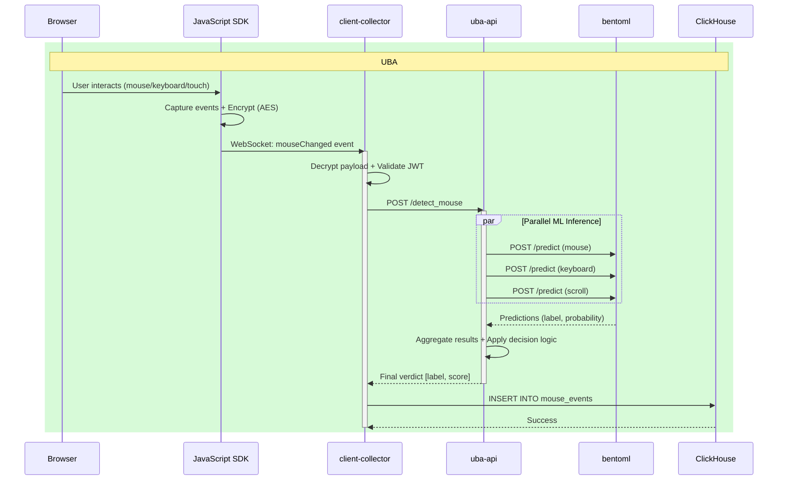

# User Behavior Analysis (UBA) Service

---
## Table of Contents

1. [Overview](#overview)
2. [Architecture](#architecture)
3. [System Components](#system-components)
4. [Data Flow](#data-flow)
5. [Database Architecture](#database-architecture)
6. [Technology Stack](#technology-stack)
7. [Quick Start](#quick-start)
8. [Documentation Structure](#documentation-structure)
9. [Deployment](#deployment)

---

## Overview

The User Behavior Analysis (UBA) service is a comprehensive bot detection system that analyzes user interactions and navigation patterns to distinguish between human users and automated bots. 

Analyzes user interaction patterns (mouse movements, keyboard input, touch gestures, scrolling) in real-time to detect bot behavior through behavioral biometrics.

**Key Features:**
- Real-time analysis of mouse, keyboard, touch, and scroll events
- SoTA supervised Machine learning models for user behavior patterns recognition

**Latency:** Less than 200ms
**Protocol:** WebSocket + HTTP


---

## Architecture

### High-Level System Architecture



### Sequence Diagram



---

## System Components

| Service | Port | Type | Language | Purpose |
|---------|------|------|----------|---------|
| **client-collector** | 3000 | WebSocket Gateway | TypeScript (NestJS) | Receives encrypted events from browser, coordinates ML inference, stores results |
| **uba-api** | 3005 | ML Orchestrator | Python (BentoML) | Routes requests to specialized ML models, aggregates predictions |
| **uba-mouse** | 3001 | ML Service | Python (BentoML) | Analyzes mouse movement patterns (velocity, acceleration, curvature) |
| **uba-keyboard** | 3002 | ML Service | Python (BentoML) | Analyzes keystroke dynamics (dwell time, flight time, rhythm) |
| **uba-scroll** | 3004 | ML Service | Python (BentoML) | Analyzes scroll behavior patterns (speed, smoothness, pauses) |
| **uba-swiping** | 3003 | ML Service | Python (BentoML) | Analyzes mobile touch/swipe patterns |

### External Dependencies

| Component | Purpose | Used By |
|-----------|---------|---------|
| **ClickHouse** | Data storage and analytics | uba-api

---


## Database Architecture

### ClickHouse Tables

**Schema:**
```sql
CREATE TABLE mouse_events
(
    client_token  String,
    client_secret String,
    type          String,        -- "BOT" or "Human"
    accuracy      Float32,       -- Confidence score (0.0 - 1.0)
    domain        String,
    data          String,        -- Raw JSON events
    created_at    DateTime DEFAULT now()
)
ENGINE = MergeTree
ORDER BY tuple()
SETTINGS index_granularity = 8192;
```

**Operations:**
- **WRITE:** client-collector (INSERT after ML prediction)
- **READ:** Analytics dashboards, reporting tools

---
## Technology Stack

### Programming Languages
- **Python 3.x** - ML services, feature extraction
- **TypeScript** - API gateways, aggregators
- **JavaScript** - Client-side SDK

### Frameworks & Libraries
- **BentoML** - ML model serving
- **NestJS** - Backend API framework
- **scikit-learn** - Machine learning (Random Forest, SVM)
- **XGBoost** - Gradient boosting models
- **Socket.IO** - WebSocket communication

### Infrastructure
- **ClickHouse** - Analytics database
- **Apache Pulsar** - Message queue
- **Docker** - Containerization
- **Kubernetes** - Orchestration
- **Jenkins** - CI/CD

---

## Quick Start

### Prerequisites

- Node.js 18+ and npm/yarn
- Python 3.8+
- Docker and Docker Compose
- ClickHouse database
- Apache Pulsar (for System B)

### Running System A (Real-time Detection)

```bash
# 1. Start client-collector
cd client-collector
npm install
cp .env.example .env
npm run start:dev

# 2. Start uba-api
cd uba-api
pip install -r requirements.txt
python service.py

# 3. Start ML models
cd uba-mouse && python service.py &
cd uba-keyboard && python service.py &
cd uba-scroll && python service.py &
cd uba-swiping && python service.py &
```

### Docker Deployment (local development)

```bash
# Start all services
docker-compose up -d

# View logs
docker-compose logs -f

# Stop all services
docker-compose down
```

---

## Documentation Structure

Each service has detailed documentation following a standard structure:

| Service | Documentation File |
|---------|-------------------|
| client-collector | `01_CLIENT_COLLECTOR_DEV.md` |
| uba-api | `02_UBA_API_DEV.md` |
| uba-mouse | `03_UBA_MOUSE_SERVICE.md` |
| uba-keyboard | `04_UBA_KEYBOARD_SERVICE.md` |
| uba-scroll | `05_UBA_SCROLL_SERVICE.md` |
| uba-swiping | `06_UBA_SWIPING_SERVICE.md` |
| user-behavior | `07_USER_BEHAVIOR_SERVICE.md` |

Each service document includes:
- Service description and purpose
- API reference (links to OpenAPI/AsyncAPI specs)
- Setup and installation instructions
- Configuration guide
- Deployment instructions (Docker, Kubernetes)
- Process flow diagrams
- Database interactions
- Troubleshooting guide

---

## API References

| Service | Specification | Format | Location |
|---------|--------------|--------|----------|
| client-collector | WebSocket API | AsyncAPI 3.0 | `api/client-collector-asyncapi.yaml` |
| uba-api | REST API | OpenAPI 3.0 | `api/uba-api-openapi.yaml` |
| uba-mouse | REST API | OpenAPI 3.0 | `api/uba-mouse-openapi.yaml` |
| uba-keyboard | REST API | OpenAPI 3.0 | `api/uba-keyboard-openapi.yaml` |
| uba-scroll | REST API | OpenAPI 3.0 | `api/uba-scroll-openapi.yaml` |
| uba-swiping | REST API | OpenAPI 3.0 | `api/uba-swiping-openapi.yaml` |

---

## Deployment

### Development Environment

```bash
# Clone repository
git clone <repository-url>
cd uba

# Start all services with Docker Compose
docker-compose -f docker-compose.dev.yml up -d
```

### Production Environment

**Kubernetes Deployment:**

```bash
# Apply all service deployments
kubectl apply -f k8s/

# Verify deployments
kubectl get pods -n uba

# View logs
kubectl logs -f <pod-name> -n uba
```

### Environment Variables

Each service requires specific environment variables. Refer to individual service documentation for details.

**Common Variables:**
- `CLICKHOUSE_HOST` - ClickHouse server address
- `CLICKHOUSE_PORT` - ClickHouse port (default: 9000)
- `CLICKHOUSE_DB` - Database name
- `PULSAR_URL` - Pulsar broker URL (System B only)
- `JWT_SECRET` - JWT signing secret
- `AES_KEY` - AES encryption key

---

## How to Read This Documentation

1. **Start here:** Read this README.md for overall architecture understanding
2. **Read service docs:** Review individual service documentation for the services you'll work on
3. **Check API specs:** Import OpenAPI/AsyncAPI specs 

---

## Monitoring and Observability

### Health Checks

All services expose health check endpoints:

```bash
# System A services
curl http://localhost:3000/health  # client-collector
curl http://localhost:3005/health  # uba-api
curl http://localhost:3001/healthz # uba-mouse
curl http://localhost:3002/healthz # uba-keyboard
curl http://localhost:3004/healthz # uba-scroll
curl http://localhost:3003/healthz # uba-swiping

```


---

**Last Updated:** 2025-12-12
