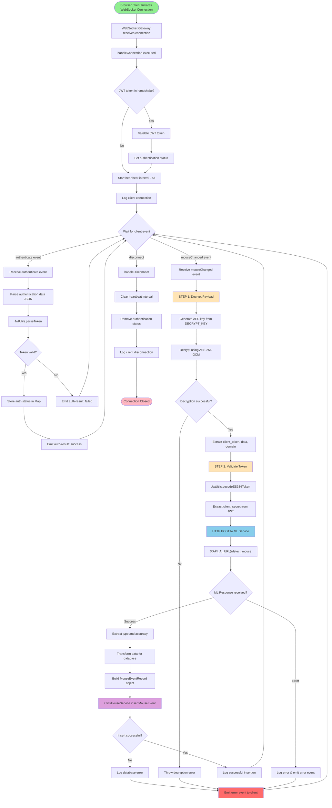

# `client-collector` Service Documentation

## Table of Contents
1. [Description](#description)
2. [API Documentation](#api-documentation)
3. [Setup from Scratch](#setup)
4. [Dependencies](#dependencies)
5. [Configuration](#configuration)
6. [Deployment](#deployment)
7. [Process Flow](#process-flow)
8. [Database Interactions](#database-interactions)
9. [Additional Information](#additional-information)

---
## Description

- **Service Name:** `client-collector`
- **Type:** WebSocket Gateway + HTTP API
- **Language:** TypeScript (NestJS Framework)
- **Port:** 3000 (configurable via `APP_PORT`)

### Purpose
The `client-collector` service acts as the **primary gateway** for collecting real-time user interaction data from client browsers. It:
- Receives encrypted interaction events (mouse, keyboard, scroll, touch) via WebSocket
- Authenticates clients using JWT tokens
- Decrypts and validates incoming data
- Forwards data to ML models for bot detection
- Stores raw events and prediction results in ClickHouse database

---

## API Documentation

> **Complete API Reference:** For detailed WebSocket API documentation including all events, schemas, examples, and security specifications, see the **[AsyncAPI Specification](.../api/client-collector-asyncapi.yaml)**

### Quick Reference

| Aspect        | Value                 |
| ------------- | --------------------- |
| **Port**      | 3000                  |
| **Protocol**  | WebSocket (Socket.IO) |
| **Language**  | TypeScript            |
| **Framework** | NestJS                |
| **Database**  | ClickHouse            |
| **Container** | mouse-traces          |
**Protocol:** WebSocket (Socket.io)
**Base URL:**
- Development: `ws://localhost:3000`
- Production: `wss://your-domain.com`

**Authentication:** JWT (ES384 algorithm)
**Encryption:** AES-256-GCM for payload data

### WebSocket Events

#### Client → Server
| Event | Purpose | Authentication Required |
|-------|---------|------------------------|
| `authenticate` | Authenticate client with JWT token | No (this provides the auth) |
| `mouseChanged` | Send encrypted interaction events | Yes (JWT in encrypted payload) |

#### Server → Client
| Event | Purpose | Frequency |
|-------|---------|-----------|
| `auth-result` | Authentication response | On authenticate event |
| `server-pong` | Heartbeat | Every 5 seconds |
| `error` | Error notifications | On processing failures |

### Connection Example

```javascript
// Connect with optional authentication
const socket = io('ws://localhost:3000', {
  transports: ['websocket'],
  auth: {
    token: 'your-jwt-token' // Optional: authenticate on connection
  }
});

// Or authenticate after connection
socket.emit('authenticate', JSON.stringify({
  client_token: 'your-jwt-token'
}));

// Listen for authentication result
socket.on('auth-result', (response) => {
  console.log('Auth status:', response.success);
});

// Send encrypted events
socket.emit('mouseChanged', {
  iv: 'base64_iv',
  encryptedData: 'base64_encrypted_data',
  tag: 'base64_auth_tag'
});

// Handle server heartbeat
socket.on('server-pong', (data) => {
  console.log('Heartbeat:', data.timestamp);
});

// Handle errors
socket.on('error', (error) => {
  console.error('Error:', error.message);
});
```


### Data Structures

**Encrypted Payload:**
```typescript
{
  iv: string;              // Base64 initialization vector
  encryptedData: string;   // Base64 encrypted payload
  tag: string;             // Base64 GCM authentication tag
}
```

**Decrypted Payload → ML Service → Database:**
```typescript
{
  client_token: string;    // JWT (ES384)
  domain: string;          // Website domain
  data: [                  // Interaction events array
    {
      timestamp: number,   // Unix ms
      x: number,          // Mouse X
      y: number,          // Mouse Y
      button: string,     // "left"|"right"|"middle"|""
      state: string,      // "click"|"move"|"scroll"|"keydown"|etc
      key: string|null,   // Keyboard key
      deltaY: number      // Scroll delta
    }
  ]
}
```

**ML Response:**
```typescript
["BOT" | "Human", 0.0-1.0]  // [classification, confidence]
```

### External Integrations

| Service | Purpose | Endpoint/Protocol |
|---------|---------|-------------------|
| uba-api | ML bot detection | HTTP POST `/detect_mouse` |
| ClickHouse | Event persistence | INSERT `mouse_events` table |

---
## Setup 

### Prerequisites
- **Node.js:** v18.17.1 or higher
- **npm:** v9.0.0 or higher
- **ClickHouse:** Database server running
- **`uba-api`:** ML service running (for bot detection)

### Step 1: Clone and Navigate
```bash
cd client-collector
```

### Step 2: Install Dependencies
```bash
npm install --legacy-peer-deps
```

### Step 3: Create Environment File
Create `.env` file in the root directory:

```bash
# Application
APP_PORT=3000
NODE_ENV=development

# ClickHouse Configuration
CLICKHOUSE_HOST=localhost
CLICKHOUSE_PORT=8123
CLICKHOUSE_USER=default
CLICKHOUSE_PASSWORD=
CLICKHOUSE_DB=default

# JWT Configuration
JWT_SECRET=your-secret-key-here
JWT_EXPIRES_IN=7d

# AES Encryption
DECRYPT_KEY=your-32-character-encryption-key

# ML API Service
API_AI_URL=http://localhost:7018
```

### Step 4: Build the Project
```bash
npm run build
```

This compiles TypeScript to JavaScript in the `dist/` directory.

### Step 5: Run Development Server
```bash
npm run start:dev
```

**Or run production build:**
```bash
npm run start:prod
```

### Step 6: Verify Server is Running
Check logs for:
- "Nest application successfully started"
- "Pulsar client initialized successfully" (if using Pulsar)
- WebSocket server listening on port 3000

### Step 7: Test WebSocket Connection
```bash
# Install wscat for testing
npm install -g wscat

# Connect to WebSocket
wscat -c ws://localhost:3000
```

---

## Dependencies

### Runtime Dependencies

#### Core Framework
- **@nestjs/core** (^10.0.0): NestJS framework core
- **@nestjs/common** (^10.0.0): Common utilities and decorators
- **@nestjs/platform-express** (^10.0.0): Express HTTP adapter
- **reflect-metadata** (^0.2.0): Metadata reflection API

#### WebSocket
- **@nestjs/websockets** (^10.3.7): WebSocket support
- **@nestjs/platform-socket.io** (^10.3.7): Socket.IO adapter
- **socket.io**: Real-time bidirectional communication

#### Database
- **@depyronick/nestjs-clickhouse** (^2.0.2): ClickHouse NestJS integration
- **clickhouse** (^2.6.0): ClickHouse client
- **typeorm** (^0.3.20): ORM for TypeScript
- **@nestjs/typeorm** (^10.0.2): TypeORM NestJS integration
- **sqlite3** (^5.1.7): SQLite database (for local development)

#### Security & Crypto
- **@nestjs/jwt** (^11.0.0): JWT token handling
- **crypto-js** (^4.2.0): AES encryption/decryption

#### HTTP Client
- **@nestjs/axios** (^4.0.0): HTTP client wrapper
- **axios** (^1.8.1): Promise-based HTTP client

#### Configuration
- **@nestjs/config** (^3.2.2): Configuration management

#### Validation
- **class-validator** (^0.14.1): Decorator-based validation
- **class-transformer** (^0.5.1): Object transformation

#### Utilities
- **rxjs** (^7.8.1): Reactive programming library
- **cookie-parser** (^1.4.6): Cookie parsing middleware

### Development Dependencies
- **@nestjs/cli** (^10.0.0): NestJS CLI
- **@nestjs/testing** (^10.0.0): Testing utilities
- **typescript** (^5.1.3): TypeScript compiler
- **jest** (^29.5.0): Testing framework
- **eslint** (^8.42.0): Code linter
- **prettier** (^3.0.0): Code formatter


---

## Configuration

### Environment Variables

| Variable | Required | Default | Description |
|----------|----------|---------|-------------|
| `APP_PORT` | No | `3000` | WebSocket server port |
| `NODE_ENV` | No | `development` | Environment mode |
| `CLICKHOUSE_HOST` | Yes | - | ClickHouse server hostname |
| `CLICKHOUSE_PORT` | No | `8123` | ClickHouse HTTP port |
| `CLICKHOUSE_USER` | No | `default` | ClickHouse username |
| `CLICKHOUSE_PASSWORD` | No | `` | ClickHouse password |
| `CLICKHOUSE_DB` | No | `default` | ClickHouse database name |
| `JWT_SECRET` | Yes | - | Secret key for JWT signing |
| `JWT_EXPIRES_IN` | No | `7d` | JWT token expiration |
| `DECRYPT_KEY` | Yes | - | AES-256 encryption key (32 chars) |
| `API_AI_URL` | Yes | `http://prx0.x-or.cloud:7018` | ML API endpoint |

### Configuration Files

#### 1. `src/config/clickhouse.config.ts`
```typescript
export default () => ({
  clickhouse: {
    host: process.env.CLICKHOUSE_HOST,
    port: parseInt(process.env.CLICKHOUSE_PORT, 10) || 8123,
    user: process.env.CLICKHOUSE_USER || 'default',
    password: process.env.CLICKHOUSE_PASSWORD || '',
    database: process.env.CLICKHOUSE_DB || 'default',
  }
});
```

#### 2. `src/config/jwt.config.ts`
```typescript
export default () => ({
  jwt: {
    secret: process.env.JWT_SECRET,
    expiresIn: process.env.JWT_EXPIRES_IN || '7d',
  }
});
```

### ClickHouse Database Setup

#### Create Database
```sql
CREATE DATABASE IF NOT EXISTS default;
```

#### Create Table
```sql
CREATE TABLE default.mouse_events (
    client_token  String,
    client_secret String,
    type          String,
    accuracy      Float32,
    domain        String,
    data          String,
    created_at    DateTime DEFAULT now()
)
ENGINE = MergeTree
ORDER BY tuple()
SETTINGS index_granularity = 8192;
```

---

## Deployment

### Docker Deployment

#### Build Docker Image
```bash
cd client-collector
docker build -t client-collector:latest .
```

#### Run with Docker Compose
Create `docker-compose.yml`:

```yaml
version: '3.8'
services:
  app:
    container_name: mouse-traces
    build:
      context: ./
      dockerfile: ./Dockerfile
    restart: unless-stopped
    environment:
      - CLICKHOUSE_HOST=${CLICKHOUSE_HOST}
      - CLICKHOUSE_PORT=${CLICKHOUSE_PORT}
      - CLICKHOUSE_USER=${CLICKHOUSE_USER}
      - CLICKHOUSE_PASSWORD=${CLICKHOUSE_PASSWORD}
      - CLICKHOUSE_DB=${CLICKHOUSE_DB}
      - JWT_SECRET=${JWT_SECRET}
      - JWT_EXPIRES_IN=${JWT_EXPIRES_IN}
      - API_AI_URL=${API_AI_URL}
      - APP_PORT=${APP_PORT}
      - DECRYPT_KEY=${DECRYPT_KEY}
    ports:
      - "${APP_PORT}:${APP_PORT}"
    networks:
      - uba-network

networks:
  uba-network:
    external: true
```

**Start service:**
```bash
docker-compose up -d
```

**View logs:**
```bash
docker-compose logs -f app
```

**Stop service:**
```bash
docker-compose down
```
---

## Process Flow

### Activity Diagram 

This Mermaid flowchart illustrates the complete client-collector workflow from WebSocket connection to data storage.



---

### Data Flow Diagram 

This diagram shows how client-collector interacts with external services and databases.

```mermaid
graph TB
    subgraph Client["Client Browser"]
        BrowserApp[Web Application with Tracking Script]
    end

    subgraph ClientCollector["client-collector Service :3000"]
        WSGateway[WebSocket Gateway<br/>EventsGateway]
        EncryptUtils[EncryptUtils<br/>AES-256-GCM Decryption]
        JWTUtils[JwtUtils<br/>ES384 Token Validation]
        CHService[ClickHouseService<br/>Database Client]
        HTTPClient[HTTP Client<br/>Axios]
    end

    subgraph MLService["uba-api Service :7018"]
        MLEndpoint["/detect_mouse" Endpoint]
        MLModel[ML Bot Detection Model]
    end

    subgraph Database["ClickHouse Database"]
        MouseEventsTable[(mouse_events table)]
    end

    subgraph EnvConfig["Environment Configuration"]
        EnvVars[".env file<br/>JWT_SECRET<br/>DECRYPT_KEY<br/>API_AI_URL<br/>CLICKHOUSE_*"]
    end

    %% WebSocket Connection
    BrowserApp -->|"1. WebSocket Connect"| WSGateway
    WSGateway -->|"Heartbeat (every 5s)<br/>server-pong event"| BrowserApp

    %% Authentication Flow
    BrowserApp -->|"2. authenticate event<br/>{client_token: JWT}"| WSGateway
    WSGateway --> JWTUtils
    JWTUtils -->|"Validate JWT"| JWTUtils
    JWTUtils -->|"auth-result event<br/>{success, message}"| WSGateway
    WSGateway -->|"3. Auth response"| BrowserApp

    %% Mouse Data Flow
    BrowserApp -->|"4. mouseChanged event<br/>{iv, encryptedData, tag}"| WSGateway
    WSGateway -->|"5. Decrypt payload"| EncryptUtils
    EncryptUtils -->|"Decrypted data<br/>{client_token, data[], domain}"| WSGateway

    WSGateway -->|"6. Validate token"| JWTUtils
    JWTUtils -->|"Decoded payload<br/>{client_secret, ...}"| WSGateway

    %% ML Service Interaction
    WSGateway -->|"7. HTTP POST<br/>POST /detect_mouse<br/>{data: [events]}"| HTTPClient
    HTTPClient -->|"8. Forward request"| MLEndpoint
    MLEndpoint -->|"9. Classify behavior"| MLModel
    MLModel -->|"10. Prediction result"| MLEndpoint
    MLEndpoint -->|"11. Response<br/>['BOT', 0.92]<br/>or ['Human', 0.85]"| HTTPClient
    HTTPClient -->|"12. Return prediction"| WSGateway

    %% Database Interaction
    WSGateway -->|"13. Prepare record<br/>{client_token, client_secret,<br/>type, accuracy, domain, data}"| CHService
    CHService -->|"14. INSERT INTO mouse_events"| MouseEventsTable
    MouseEventsTable -->|"15. Insert confirmation"| CHService
    CHService -->|"16. Log success"| WSGateway

    %% Error Handling
    WSGateway -.->|"Error event<br/>(on failures)"| BrowserApp

    %% Configuration
    EnvConfig -.->|"Load config"| WSGateway
    EnvConfig -.->|"Load config"| JWTUtils
    EnvConfig -.->|"Load config"| EncryptUtils
    EnvConfig -.->|"Load config"| CHService
    EnvConfig -.->|"Load config"| HTTPClient

    %% Styling
    style BrowserApp fill:#E8F5E9
    style WSGateway fill:#BBDEFB
    style MLEndpoint fill:#FFE082
    style MLModel fill:#FFD54F
    style MouseEventsTable fill:#CE93D8
    style EnvVars fill:#FFCCBC

    classDef serviceBox fill:#E3F2FD,stroke:#1976D2,stroke-width:2px
    classDef dataStore fill:#F3E5F5,stroke:#7B1FA2,stroke-width:2px
    classDef external fill:#FFF3E0,stroke:#F57C00,stroke-width:2px

    class ClientCollector serviceBox
    class Database dataStore
    class MLService external
```



1. **Connection Established**
   - Client connects via WebSocket
   - Server logs connection with client ID
   - Optional: Check for token in handshake headers
   - Start heartbeat interval (emit `server-pong` every 5s)

2. **Authentication (Optional Step)**
   - Client emits `authenticate` event with JWT token
   - Server validates token using `JwtUtils`
   - Store authentication status in memory Map
   - Emit `auth-result` to client

3. **Receive Interaction Data**
   - Client emits `mouseChanged` with encrypted payload
   - Server receives: `{iv, encryptedData, tag}`

4. **Decrypt Payload**
   - Load AES key from `DECRYPT_KEY` environment variable
   - Decrypt using AES-256-GCM algorithm
   - Extract: `{client_token, data[], domain}`

5. **Validate JWT Token**
   - Decode ES384 JWT token
   - Extract `client_secret` from payload
   - Verify token signature and expiration

6. **Forward to ML Service**
   - HTTP POST to `${API_AI_URL}/detect_mouse`
   - Send interaction events array
   - Wait for response (with timeout)

7. **Receive ML Prediction**
   - Response: `["BOT", 0.92]` or `["Human", 0.85]`
   - Extract label (index 0) and probability (index 1)

8. **Prepare Database Record**
   - Combine original data with prediction
   - Stringify events array to JSON
   - Include client info and prediction results

9. **Store to ClickHouse**
   - INSERT into `mouse_events` table
   - Auto-generate `created_at` timestamp
   - Handle errors gracefully

10. **Cleanup on Disconnect**
    - Clear heartbeat interval
    - Remove from authentication Map
    - Close WebSocket connection
    - Log disconnection

---

## Database Interactions

### ClickHouse Database

#### Connection Configuration
```typescript
// Module: ClickHouseModule
{
  host: process.env.CLICKHOUSE_HOST,
  port: parseInt(process.env.CLICKHOUSE_PORT, 10) || 8123,
  username: process.env.CLICKHOUSE_USER || 'default',
  password: process.env.CLICKHOUSE_PASSWORD || '',
  database: process.env.CLICKHOUSE_DB || 'default'
}
```

### Table: `mouse_events`

#### Schema
```sql
CREATE TABLE mouse_events (
    client_token  String,
    client_secret String,
    type          String,
    accuracy      Float32,
    domain        String,
    data          String,
    created_at    DateTime DEFAULT now()
)
ENGINE = MergeTree
ORDER BY tuple()
SETTINGS index_granularity = 8192;
```

| Column          | Type     | Nullable | Description                                   |
| --------------- | -------- | -------- | --------------------------------------------- |
| `client_token`  | String   | No       | Original JWT token from client                |
| `client_secret` | String   | No       | Decoded client identifier from JWT            |
| `type`          | String   | No       | Prediction result: "BOT" or "Human"           |
| `accuracy`      | Float32  | No       | Confidence score (0.0 - 1.0)                  |
| `domain`        | String   | No       | Website domain where events occurred          |
| `data`          | String   | No       | JSON-stringified array of interaction events  |
| `created_at`    | DateTime | No       | Timestamp of record creation (auto-generated) |

#### Operations

##### 1. INSERT (Write)
**File:** `src/services/clickhouse.service.ts:13-25`

```typescript
async insertMouseEvent(rawData: any) {
  return this.analyticsServer
    .insertPromise<any>(`${process.env.CLICKHOUSE_DB || "default"}.mouse_events`, [
      rawData,
    ])
    .then((result) => {
      this.logger.log(`Inserted mouse event: ${rawData.client_secret}`);
      return result;
    })
    .catch((error) => {
      this.logger.error(`Failed to insert mouse event: ${error.message}`);
      throw error;
    });
}
```

**Frequency:** Real-time (on each `mouseChanged` event)

**Example Data:**
```json
{
  "client_token": "eyJhbGciOiJFUzM4NCIsInR5cCI6IkpXVCJ9...",
  "client_secret": "user_abc123",
  "type": "BOT",
  "accuracy": 0.92,
  "domain": "example.com",
  "data": "[{\"timestamp\":1234567890,\"x\":450,\"y\":320,\"button\":\"left\",\"state\":\"click\"}]",
  "created_at": "2025-12-05 10:30:45"
}
```

##### 2. SELECT (Read)
**File:** `src/services/clickhouse.service.ts:32-98`

```typescript
getMouseEvents(options?: {
  clientId?: string;
  hostname?: string;
  mouseType?: string;
  fromDate?: Date | string;
  toDate?: Date | string;
  limit?: number;
  offset?: number;
}): any
```

**Query Example:**
```sql
SELECT * FROM mouse_traces.mouse_events
WHERE client_id = 'user_abc123'
  AND timestamp >= '2025-12-01 00:00:00'
  AND timestamp <= '2025-12-05 23:59:59'
ORDER BY timestamp DESC
LIMIT 1000
```

---

## Additional Information

### Error Handling

#### Common Errors

1. **Decryption Failed**
   - **Cause:** Invalid encryption key or corrupted data
   - **Error:** `"Failed to decrypt data"`
   - **Solution:** Verify `DECRYPT_KEY` matches client encryption key

2. **JWT Validation Failed**
   - **Cause:** Invalid token, expired token, or wrong secret
   - **Error:** `"Invalid token"`
   - **Solution:** Check `JWT_SECRET` and token expiration

3. **ML Service Unavailable**
   - **Cause:** uba-api service down or unreachable
   - **Error:** `"Error processing mouse data"`
   - **Solution:** Verify `API_AI_URL` and service health

4. **ClickHouse Connection Failed**
   - **Cause:** Database unreachable or wrong credentials
   - **Error:** `"Failed to insert mouse event"`
   - **Solution:** Check `CLICKHOUSE_HOST`, credentials, and network

### Logging

**Log Levels:**
- `INFO`: Normal operations (connections, successful inserts)
- `WARN`: Authentication failures, unusual events
- `ERROR`: Critical failures (DB errors, ML service errors)

**Log Examples:**
```
[INFO] Client connected: socket-abc123
[INFO] Client socket-abc123 authenticated successfully
[INFO] Inserted mouse event: user_abc123
[ERROR] Error processing mouse data: Failed to decrypt data
[WARN] Client socket-xyz789 failed authentication
```

---

- **Last Updated:** 2025-12-09
