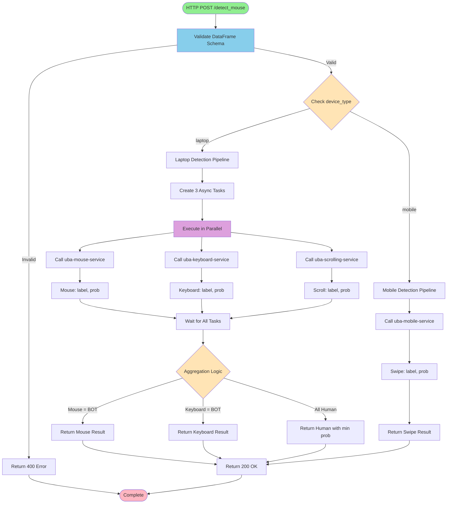
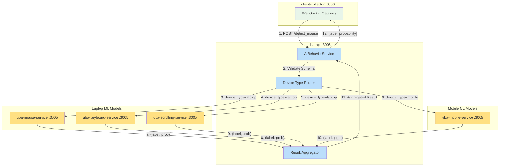

# UBA-API Documentation

## Table of Contents
1. [Description](#description)
2. [API Documentation](#api-documentation)
3. [Setup](#setup)
4. [Dependencies](#dependencies)
5. [Configuration](#configuration)
6. [Deployment](#deployment)
7. [Process Flow](#process-flow)
8. [Database Interactions](#database-interactions)
9. [Additional Information](#additional-information)

---

## Description

- **Service Name:** `uba-api`
- **Type:** ML Orchestration Service / API Gateway / HTTP API
- **Language:** Python 3.12
- **Port:** 3005 (configurable via environment)

### Purpose

The `uba-api` service acts as the ML orchestration layer that coordinates bot detection across multiple specialized machine learning models, routes requests from `client-collector` to appropriate ML models based on device type, executes parallel inference across multiple models.

---

## API Documentation

> **Complete API Reference:** For detailed API documentation including all endpoints, schemas, examples, and request/response specifications, see the **[OpenAPI Specification](../api/uba-api-openapi.yaml)**

### Quick Reference

| Aspect              | Value               |
| ------------------- | ------------------- |
| **Port**            | 3005                |
| **Protocol**        | HTTP/REST           |
| **Language**        | Python 3.12         |
| **Framework**       | BentoML             |
| **Database**        | None (stateless)    |
| **Container**       | uba-gateway-service |
| **Default Workers** | 4                   |
**Base URL:**
- Development: `http://localhost:3005`
- Production: `http://uba-gateway-service:3005`

**Authentication:** None (internal service)
**Data Format:** JSON

### REST Endpoints

#### Request

| Endpoint        | Method | Purpose                                     | Device Types   |
| --------------- | ------ | ------------------------------------------- | -------------- |
| `/detect_mouse` | POST   | Detect bot behavior from interaction events | laptop, mobile |

#### Response

| Status | Description           | Response Type          |
| ------ | --------------------- | ---------------------- |
| 200    | Successful detection  | `[label, probability]` |
| 400    | Bad request           | Error object           |
| 500    | Internal server error | Error object           |

### Usage Example

```python
import requests

# Prepare interaction data
data = [
    {
        "timestamp": 1234567890123,
        "button": "left",
        "state": "click",
        "x": 450,
        "y": 320,
        "key": None,
        "deltaY": 0
    },
    {
        "timestamp": 1234567890456,
        "button": "",
        "state": "move",
        "x": 455,
        "y": 325,
        "key": None,
        "deltaY": 0
    }
]

# Make request
response = requests.post(
    "http://localhost:3005/detect_mouse",
    json={"data": data, "device_type": "laptop"}
)

# Parse response
label, probability = response.json()
print(f"Detection: {label} (confidence: {probability:.2%})")
# Output: Detection: BOT (confidence: 92.00%)
```

### Data Structures

**Request Payload:**
```typescript
interface DetectionRequest {
  data: InteractionEvent[];
  device_type: "laptop" | "mobile";
}

interface InteractionEvent {
  timestamp: number;      // Unix timestamp in milliseconds
  button: string;         // "left", "right", "middle", ""
  state: string;          // "click", "move", "keydown", "scroll", etc.
  x: number;              // X coordinate
  y: number;              // Y coordinate
  key: string | null;     // Keyboard key (null for mouse events)
  deltaY: number;         // Scroll delta (0 for non-scroll events)
}
```

**Response Schema:**
```typescript
type DetectionResponse = [string, number];
// [0]: "BOT" or "Human"
// [1]: Probability (0.0 - 1.0)
```

### External Integrations

| Service               | Purpose                    | Endpoint/Protocol       |
| --------------------- | -------------------------- | ----------------------- |
| uba-mouse-service     | Mouse behavior analysis    | HTTP POST :3005/predict |
| uba-keyboard-service  | Keyboard dynamics analysis | HTTP POST :3005/predict |
| uba-scrolling-service | Scroll pattern analysis    | HTTP POST :3005/predict |
| uba-swiping-service   | Touch/swipe analysis       | HTTP POST :3005/predict |

---
## Setup
### Prerequisites

- **Python:** 3.12 or higher
- **pip:** Latest version
- **Docker:** Optional, for containerized deployment
- **Downstream Services:** `uba-mouse`, `uba-keyboard`, `uba-scrolling`, `uba-swiping` services must be running and accessible

### Step 1: Clone and Navigate

```bash
cd uba-api
```

### Step 2: Install Dependencies

```bash
pip install -r requirements.txt
```

**requirements.txt contents:**
```
bentoml
python-dotenv
pandas
```

### Step 3: Create Environment File

Create `.env` file in the service directory:

```bash
# Worker Configuration
WORKERS=4

# Downstream Model Endpoints
MOUSE_ENDPOINT=http://localhost:3005
KEYBOARD_ENDPOINT=http://localhost:3005
MOBILE_ENDPOINT=http://localhost:3005
SCROLL_ENDPOINT=http://localhost:3005
```

**Note:** Update endpoints to point to actual service URLs in production:
```bash
MOUSE_ENDPOINT=http://uba-mouse-service:3005
KEYBOARD_ENDPOINT=http://uba-keyboard-service:3005
MOBILE_ENDPOINT=http://uba-mobile-service:3005
SCROLL_ENDPOINT=http://uba-scrolling-service:3005
```

### Step 4: Build the Project

No build step required for Python services. Dependencies are installed via pip.

### Step 5: Run Development Server

```bash
bentoml serve service:AIBehaviorService --port 3005 --host 0.0.0.0
```

**Expected output:**
```
Starting BentoML HTTP server on http://0.0.0.0:3005
Service loaded: AIBehaviorService
Workers: 4
```

### Step 6: Verify Server is Running

```bash
curl http://localhost:3005/health
```

**Expected response:**
```json
{
  "status": "ok",
  "service": "uba-api"
}
```

### Step 7: Test API Endpoints

```bash
curl -X POST http://localhost:3005/detect_mouse \
  -H "Content-Type: application/json" \
  -d '{
    "data": [
      {"timestamp": 1234567890, "button": "left", "state": "click", "x": 450, "y": 320, "key": null, "deltaY": 0}
    ],
    "device_type": "laptop"
  }'
```

**Expected response:**
```json
["BOT", 0.92]
```

---

## Dependencies

### Runtime Dependencies

- **bentoml** (latest): ML model serving framework, Provides HTTP server with async support
- **pandas** (latest): DataFrame manipulation for ML input, Data validation and type checking
- **python-dotenv** (latest): Environment variable management
- **asyncio:** Async/await support for parallel execution
- **logging:** Structured logging
- **typing_extensions:** Type hints for Python 3.12

### External Service Dependencies

| Service               | Type | Required          | Purpose                    | Default Endpoint                  |
| --------------------- | ---- | ----------------- | -------------------------- | --------------------------------- |
| uba-mouse-service     | HTTP | Yes (laptop mode) | Mouse behavior analysis    | http://uba-mouse-service:3005     |
| uba-keyboard-service  | HTTP | Yes (laptop mode) | Keyboard dynamics analysis | http://uba-keyboard-service:3005  |
| uba-scrolling-service | HTTP | Yes (laptop mode) | Scroll pattern analysis    | http://uba-scrolling-service:3005 |
| uba-swiping-service   | HTTP | Yes (mobile mode) | Touch/swipe analysis       | http://uba-mobile-service:3005    |

---

## Configuration

### Environment Variables

| Variable | Required | Default | Description |
|----------|----------|---------|-------------|
| `WORKERS` | No | `4` | Number of worker processes for BentoML server |
| `MOUSE_ENDPOINT` | No | `http://uba-mouse-service:3005` | Mouse model service URL |
| `KEYBOARD_ENDPOINT` | No | `http://uba-keyboard-service:3005` | Keyboard model service URL |
| `MOBILE_ENDPOINT` | No | `http://uba-mobile-service:3005` | Mobile/swipe model service URL |
| `SCROLL_ENDPOINT` | No | `http://uba-scrolling-service:3005` | Scroll model service URL |

### Configuration Files

#### 1. `.env`
```bash
# Worker configuration
WORKERS=4

# Downstream service endpoints
MOUSE_ENDPOINT=http://uba-mouse-service:3005
KEYBOARD_ENDPOINT=http://uba-keyboard-service:3005
MOBILE_ENDPOINT=http://uba-mobile-service:3005
SCROLL_ENDPOINT=http://uba-scrolling-service:3005
```

#### 2. `service.py` (Configuration in code)

**File:** `service.py:19-24`

```python
@bentoml.service(
    workers=int(os.getenv("WORKERS", 4)),
    metrics={
        "enabled": False,
        "namespace": "bentoml_service",
    }
)
```

**Metrics Configuration:**
- Currently disabled (`enabled: False`)
- Can be enabled for production monitoring
- Namespace: `bentoml_service`

---

## Deployment

### Docker Deployment

#### Build Docker Image

```bash
docker build -t uba-api:latest -f Dockerfile .
```

#### Run with Docker Compose

**docker-compose.yml example:**
```yaml
version: '3.8'

services:
  uba-mouse-service:
    image: stormbird/uba-mouse-service:dev
    environment:
      - WORKERS=12
    command: bentoml serve service:MouseService --port 3005 --host 0.0.0.0
    networks:
      - uba-networks

  uba-keyboard-service:
    image: stormbird/uba-keyboard-service:dev
    environment:
      - WORKERS=4
    command: bentoml serve service:KeyboardService --port 3005 --host 0.0.0.0
    networks:
      - uba-networks

  uba-mobile-service:
    image: stormbird/uba-mobile-service:dev
    environment:
      - WORKERS=4
    command: bentoml serve service:MobileService --port 3005 --host 0.0.0.0
    networks:
      - uba-networks

  uba-scrolling-service:
    image: stormbird/uba-scroll-service:dev
    environment:
      - WORKERS=4
    command: bentoml serve service:ScrollService --port 3005 --host 0.0.0.0
    networks:
      - uba-networks

  uba-gateway-service:
    image: stormbird/uba-gateway-service:dev
    ports:
      - 3005:3005
    environment:
      - WORKERS=4
      - MOUSE_ENDPOINT=http://uba-mouse-service:3005
      - KEYBOARD_ENDPOINT=http://uba-keyboard-service:3005
      - MOBILE_ENDPOINT=http://uba-mobile-service:3005
      - SCROLL_ENDPOINT=http://uba-scrolling-service:3005
    command: bentoml serve service:AIBehaviorService --port 3005 --host 0.0.0.0
    networks:
      - uba-networks
    depends_on:
      - uba-mouse-service
      - uba-keyboard-service
      - uba-mobile-service
      - uba-scrolling-service

networks:
  uba-networks:
    driver: bridge
```

**Start service:**
```bash
docker-compose up -d
```

**View logs:**
```bash
docker-compose logs -f uba-gateway-service
```

**Stop service:**
```bash
docker-compose down
```

---

## Process Flow

### Activity Diagram 

This Mermaid flowchart illustrates the complete workflow from request receipt to response delivery.



---

### Data Flow Diagram 

This diagram shows how `uba-api` interacts with upstream and downstream services.


#### Laptop Mode (Parallel Execution)

1. **Receive Request**
   - HTTP POST to `/detect_mouse`
   - Parse JSON body with `data` array and `device_type: "laptop"`
   - File: `service.py:51-56`

2. **Validate Input**
   - BentoML validates DataFrame schema automatically
   - Check required columns: `timestamp`, `button`, `state`, `x`, `y`, `key`, `deltaY`
   - Verify orient is `records`
   - File: `service.py:53-55`

3. **Create Parallel Tasks**
   - Use `asyncio.TaskGroup()` for structured concurrency
   - Create 3 tasks simultaneously for mouse, keyboard, and scroll detection
   - File: `service.py:60-63`

4. **Execute Model Calls (Parallel)**
   - Each task makes async HTTP POST to its respective service
   - All 3 requests execute concurrently via `AsyncHTTPClient`
   - Endpoint method: `predict`
   - File: `service.py:40-48`

5. **Wait for All Results**
   - TaskGroup ensures all tasks complete before proceeding
   - Extract results from each task
   - File: `service.py:65-67`

6. **Apply Aggregation Logic**
   - Priority 1: If mouse detected BOT, return mouse result immediately
   - Priority 2: If keyboard detected BOT, return keyboard result
   - Priority 3: If all detected Human, return "Human" with minimum probability
   - File: `service.py:73-78`

7. **Return Aggregated Result**
   - Format as tuple: `("BOT", 0.92)` or `("Human", 0.78)`
   - BentoML serializes to JSON array: `["BOT", 0.92]`
   - Return HTTP 200 OK

#### Mobile Mode (Single Model)

1. **Receive Request**
   - HTTP POST to `/detect_mouse`
   - Parse JSON body with `device_type: "mobile"`
   - File: `service.py:51-56`

2. **Validate Input**
   - Same validation as laptop mode
   - File: `service.py:53-55`

3. **Call Mobile Service**
   - Single async call to `uba-mobile-service`
   - No parallel execution needed
   - File: `service.py:81-82`

4. **Receive Result**
   - Extract label and probability from response
   - File: `service.py:82-83`

5. **Return Result**
   - Direct passthrough of mobile service result
   - Return HTTP 200 OK with `[label, probability]`
   - File: `service.py:84`

---

## Database Interactions

**Note:** The uba-api service does **NOT** interact with any database directly.

---

## Additional Information

### Error Handling

#### Input Validation Errors

**Handled by BentoML:**
- Invalid DataFrame schema (missing columns, wrong types)
- Returns HTTP 422 Unprocessable Entity

**Example:**
```python
# Missing required column 'timestamp'
# Response: 422 Unprocessable Entity
{
  "error": "Validation error",
  "message": "Invalid DataFrame schema"
}
```

#### Downstream Service Failures

**Current Behavior:**
Each downstream model service has error handling that returns `("Human", 1.0)` on failure.

**File:** Model services (uba-mouse, uba-keyboard, etc.)
```python
try:
    # Model inference
    label, prob = self.pipeline.predict(features)
except Exception as e:
    logger.error(e)
    return "Human", 1.0  # Safe default
```
### Logging

**Log Configuration:**
```python
# File: service.py:13-15
logging.basicConfig(level=logging.INFO)
logger = logging.getLogger("bentoml")
```

**Log Levels:**
- `INFO`: Normal operations, model calls, results, endpoint initialization
- `ERROR`: Model failures, network errors (in downstream services)

**Example Log Output:**
```
INFO: Mouse endpoint: http://uba-mouse-service:3005
INFO: Keyboard endpoint: http://uba-keyboard-service:3005
INFO: Swipe endpoint: http://uba-mobile-service:3005
INFO: Scroll endpoint: http://uba-scrolling-service:3005
INFO: Response from http://uba-mouse-service:3005: - ('BOT', 0.92)
INFO: Mouse label: BOT, Mouse prob: 0.92
INFO: Keyboard label: Human, Keyboard prob: 0.78
INFO: Scroll label: Human, Scroll prob: 0.81
```

**Log Locations:**
- Development: `stdout`/`stderr`
- Docker: Container logs accessible via `docker logs`


### Monitoring & Observability

**Enable BentoML Metrics:**

```python
# File: service.py:21-24
@bentoml.service(
    workers=int(os.getenv("WORKERS", 4)),
    metrics={
        "enabled": True,  # Change to True
        "namespace": "uba_api",
    }
)
```

**Available Metrics:**
- Request count by endpoint
- Response time percentiles (p50, p95, p99)
- Error rate by error type
- Active request count
- Worker utilization

### Troubleshooting

#### High Response Time

**Diagnosis:**
```bash
# Check downstream service health
curl http://uba-mouse-service:3005/health
curl http://uba-keyboard-service:3005/health
curl http://uba-scrolling-service:3005/health

# Check network latency
ping uba-mouse-service
```

#### Predictions Always Return "Human"

**Possible Causes:**
1. All downstream models failing (check logs)
2. Models not loaded properly
3. Feature extraction failing

#### Service Won't Start

**Diagnosis:**
```bash
# Check port availability
netstat -tuln | grep 3005

# Verify Python version
python --version  # Should be 3.12+

# Check dependencies
pip list | grep bentoml
pip list | grep pandas

# Check environment variables
env | grep ENDPOINT
```

**Solutions:**
- Kill process using port 3005
- Install correct Python version
- Reinstall dependencies: `pip install -r requirements.txt`
- Verify `.env` file exists and is properly formatted

#### Connection Refused to Downstream Services

**Diagnosis:**
```bash
# Verify services are running
docker ps | grep uba-

# Check network connectivity
docker network ls
docker network inspect uba-networks
```

**Solutions:**
- Start downstream services: `docker-compose up -d`
- Verify service names in docker-compose match environment variables
- Check network configuration in docker-compose


---

**Last Updated:** 2025-12-10
