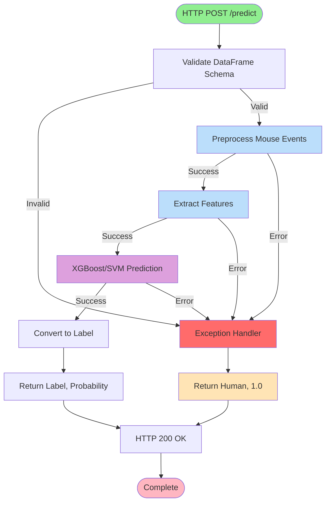
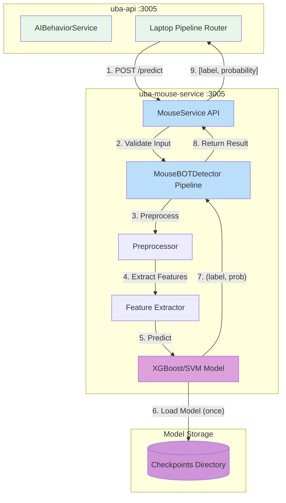

# UBA Mouse Service Documentation

## Table of Contents
1. [Description](#description)
2. [API Documentation](#api-documentation)
3. [Setup](#setup)
4. [Dependencies](#dependencies)
5. [Configuration](#configuration)
6. [Deployment](#deployment)
7. [Process Flow](#process-flow)
8. [Database Interactions](#database-interactions)
9. [Additional Information](#additional-information)

---

## Description

- **Service Name:** `uba-mouse`
- **Type:** ML Inference Service (Mouse Behavior Detection)
- **Language:** Python 3.12
- **Port:** 3005 (configurable via environment)

### Purpose

`uba-mouse` is a specialized machine learning inference service to detect bot behavior by analyzing mouse movement patterns. It uses Support Vector Machine (SVM) or XGBoost models trained on mouse dynamics features to distinguish between human and bot interactions.

### Features

The service analyzes multiple aspects of mouse dynamics:

- **Velocity Features:** Speed of cursor movement (mean, std, percentiles, variance)
- **Acceleration Features:** Changes in speed over time, acceleration patterns
- **Curvature Features:** Path straightness, angular velocity, direction changes
- **Jerk Features:** Rate of acceleration change, smoothness metrics
- **Temporal Features:** Time between actions, pause patterns, click frequency
- **Spatial Features:** Movement range, coverage area, target accuracy
- **Action Patterns:** Click sequences, hover behavior, drag characteristics

### Model Information

- **Algorithm:** XGBoost Classifier / SVM with linear kernel
- **Training Data:** Balabit Mouse Dynamics dataset + synthetic bot data
- **Model Path:** `mouse_bot_detector/checkpoints/xgboost/7_5/stable/long/`

---

## API Documentation

> **Complete API Reference:** For detailed API documentation including all endpoints, schemas, examples, and feature specifications, see the **[OpenAPI Specification](../api/uba-mouse-openapi.yaml)**

### Quick Reference
| Aspect                  | Value                          |
| ----------------------- | ------------------------------ |
| **Port**                | 3005                           |
| **Protocol**            | HTTP/REST                      |
| **Language**            | Python 3.12                    |
| **Framework**           | BentoML + scikit-learn/XGBoost |
| **Model**               | XGBoost Classifier / SVM       |
| **Features**            | 200+ engineered features       |
| **Accuracy**            | ~95%                           |
| **Inference Time**      | 5-20ms                         |
| **Memory Usage**        | ~500MB-1GB per worker          |
| **Recommended Workers** | 12                             |
| **Database**            | None (stateless)               |
| **Scaling**             | Horizontal (stateless)         |

**Base URL:**
- Development: `http://localhost:3005`
- Production: `http://uba-mouse-service:3005`

**Authentication:** None (internal service)
**Request Format:** `JSON`

### REST Endpoints

#### Request

| Endpoint | Method | Purpose | Input Type |
|----------|--------|---------|------------|
| `/predict` | POST | Classify mouse behavior as BOT or Human | Mouse event array |

#### Response

| Status | Description | Response Type |
|--------|-------------|---------------|
| 200 | Successful prediction | `[label, probability]` |
| 400 | Bad request | Error object |
| 500 | Internal error (returns safe default) | `["Human", 1.0]` |

### Usage Example

```python
import requests

# Prepare mouse events
events = [
    {
        "timestamp": 1234567890123,
        "button": "",
        "state": "move",
        "x": 100,
        "y": 100,
        "key": None,
        "deltaY": 0
    },
    {
        "timestamp": 1234567890173,
        "button": "",
        "state": "move",
        "x": 105,
        "y": 103,
        "key": None,
        "deltaY": 0
    },
    {
        "timestamp": 1234567890223,
        "button": "left",
        "state": "click",
        "x": 110,
        "y": 108,
        "key": None,
        "deltaY": 0
    }
]

# Make prediction request
response = requests.post(
    "http://localhost:3005/predict",
    json={"data": events}
)

# Parse result
label, probability = response.json()
print(f"Prediction: {label} (confidence: {probability:.2%})")
# Output: Prediction: BOT (confidence: 95.00%)
```

### Data Structures

**Request Payload:**
```typescript
interface PredictionRequest {
  data: MouseEvent[];
}

interface MouseEvent {
  timestamp: number;      // Unix timestamp in milliseconds
  button: string;         // "left", "right", "middle", ""
  state: string;          // "click", "move", "down", "up", "scroll"
  x: number;              // X coordinate in pixels
  y: number;              // Y coordinate in pixels
  key: string | null;     // Always null for mouse events
  deltaY: number;         // Scroll delta (0 for mouse movements)
}
```

**Response Format:**
```typescript
type PredictionResponse = [string, number];
// [0]: "BOT" or "Human"
// [1]: Probability (0.0 - 1.0)
```

### External Integrations

| Service | Purpose | Endpoint/Protocol |
|---------|---------|-------------------|
| uba-api | ML orchestration gateway | HTTP POST /detect_mouse |

---

## Setup

### Prerequisites

- **Python:** 3.12 or higher
- **pip:** Latest version
- **Docker:** Optional, for containerized deployment
- **Model Files:** Pre-trained models in checkpoints directory

### Step 1: Clone and Navigate

```bash
cd uba-mouse
```

### Step 2: Install Dependencies

**Option 1: Install package in development mode (recommended)**
```bash
pip install -e .
```

This installs the `mouse_bot_detector` package with all dependencies from `pyproject.toml`.

**Option 2: Install from requirements.txt**
```bash
pip install -r requirements.txt
```

### Step 3: Verify Installation

```bash
python -c "from mouse_bot_detector import MouseBOTDetector; print('OK')"
```

**Expected output:** `OK`

### Step 4: Verify Model Files

```bash
ls mouse_bot_detector/checkpoints/xgboost/7_5/stable/long/
```

**Expected files:**
- Model file (.pkl, .joblib, or .json)
- Scaler file (scaler.pkl)
- Feature configuration files

### Step 5: Create Environment File

Create `.env` file (optional):

```bash
WORKERS=12
```

### Step 6: Run Development Server

```bash
bentoml serve service:MouseService --port 3005 --host 0.0.0.0
```

**Expected output:**
```
Starting BentoML HTTP server on http://0.0.0.0:3005
Service loaded: MouseService
Workers: 12
```

### Step 7: Test API Endpoints

```bash
curl -X POST http://localhost:3005/predict \
  -H "Content-Type: application/json" \
  -d '{
    "data": [
      {"timestamp": 1234567890, "button": "", "state": "move", "x": 100, "y": 100, "key": null, "deltaY": 0}
    ]
  }'
```

**Expected response:**
```json
["BOT", 0.95]
```

---

## Dependencies

- **scikit-learn** (latest): SVM classifier implementation; Feature scaling (StandardScaler)
- **xgboost** (latest): Gradient boosting classifier
- **numpy** (latest): Numerical computing for feature calculations
- **scipy** (latest): Scientific computing functions
- **pandas** (latest): DataFrame operations for data manipulation
- **bentoml** (latest): ML model serving framework
- **pydantic** (latest): Data validation and settings management
- **matplotlib:** Plotting and visualization
- **seaborn:** Statistical visualization
- **mlflow:** Experiment tracking and model registry
- **hyperopt:** Hyperparameter optimization

### Python Package Structure

- **Package Name:** `mouse_bot_detector`
- **Version:** 0.1.0

**Module Structure:**
```
mouse_bot_detector/
├── __init__.py                 # Exports MouseBOTDetector
├── mouse_classifer.py          # Main classifier class
├── feature_extraction.py       # Feature engineering pipeline
├── core/
│   ├── model.py               # Model wrapper
│   └── feature_transform.py   # Feature transformations
├── feature/
│   ├── actions.py             # Action-based features
│   └── general_statistics.py  # Statistical features
├── checkpoints/
│   └── xgboost/7_5/stable/long/  # Pre-trained models
└── bot_generator/
    ├── bezier.py              # Synthetic bot data (Bezier curves)
    └── straight.py            # Synthetic bot data (straight lines)
```

**Model Persistence:**
- Pre-trained models stored on disk
- Loaded once on service startup
- Kept in memory for fast inference

---

## Configuration

### Environment Variables

| Variable | Required | Default | Description |
|----------|----------|---------|-------------|
| `WORKERS` | No | `4` | Number of worker processes (recommended: 12 for production) |

### Configuration Files

#### 1. `.env`
```bash
# Worker configuration
WORKERS=12
```

#### 2. `service.py` (Configuration in code)

**File:** `service.py:13-18`

```python
@bentoml.service(
    workers=int(os.getenv("WORKERS", 4)),
    metrics={
        "enabled": False,
        "namespace": "bentoml_service",
    }
)
```

**Metrics Configuration:**
- Currently disabled (`enabled: False`)
- Can be enabled for production monitoring
- Namespace: `bentoml_service`

### Model Configuration

**Model Files Location:**
```
mouse_bot_detector/checkpoints/xgboost/7_5/stable/long/
```

**Model Components:**
- Trained classifier (XGBoost or SVM)
- Feature scaler (StandardScaler)
- Feature extraction configuration
- Model metadata

**Loading Configuration:**
- Models loaded automatically on service initialization
- File: `service.py:21-22`
```python
def __init__(self):
    self.pipeline = MouseBOTDetector()
```

---

## Deployment

### Docker 

#### Build Docker Image

```bash
docker build -t uba-mouse-service:latest -f Dockerfile .
```

#### Run Container

```bash
docker run -d \
  --name uba-mouse-service \
  -p 3005:3005 \
  -e WORKERS=12 \
  uba-mouse-service:latest
```

#### View Logs

```bash
docker logs -f uba-mouse-service
```

#### Run with Docker Compose

**docker-compose.yml example:**
```yaml
version: '3.8'

services:
  uba-mouse-service:
    image: stormbird/uba-mouse-service:dev
    container_name: uba-mouse
    environment:
      - WORKERS=12
    command: bentoml serve service:MouseService --port 3005 --host 0.0.0.0
    ports:
      - "3005:3005"
    networks:
      - uba-networks
    restart: unless-stopped
    healthcheck:
      test: ["CMD", "curl", "-f", "http://localhost:3005/healthz"]
      interval: 30s
      timeout: 10s
      retries: 3

networks:
  uba-networks:
    driver: bridge
```

**Start service:**
```bash
docker-compose up -d uba-mouse-service
```

**View logs:**
```bash
docker-compose logs -f uba-mouse-service
```

**Stop service:**
```bash
docker-compose down
```

---

## Process Flow

### Activity Diagram - ML Inference Pipeline

This Mermaid flowchart illustrates the complete prediction workflow.



---

### Data Flow Diagram - Service Interactions

This diagram shows how uba-mouse integrates with the UBA system.




1. **Receive Request**
   - HTTP POST to `/predict`
   - Parse JSON body with `data` array

2. **Validate Input**
   - BentoML validates DataFrame schema automatically
   - Check required columns: `timestamp`, `button`, `state`, `x`, `y`, `key`, `deltaY`
   - Verify orient is `records`

3. **Preprocess Mouse Events**
   - Clean data: remove duplicates, sort by timestamp
   - Filter noise and outliers
   - Normalize coordinates
   - Transform to action-based representation
   - Calculate time deltas between events
   - Compute distances between positions
 
3. **Extract Features** (refer to [Features](###Features) for the feature engineering details)

4. **Scale Features**
   - Apply StandardScaler (pre-fitted during training)
   - Transform features to zero mean, unit variance

6. **ML Prediction**
   - Load pre-trained XGBoost/SVM model
   - Predict class: 0 (Human) or 1 (BOT)
   - Get probability scores for both classes

7. **Post-Processing**
   - Convert class to label: 0 → "Human", 1 → "BOT"
   - Extract confidence: probability of predicted class
   - Example: class=1, probs=[0.05, 0.95] → ("BOT", 0.95)

8. **Error Handling**
   - Wrap entire pipeline in try-except
   - On any exception: log error, return ("Human", 1.0)
   - Prevents false positives that could block users
   - File: `service.py:35-37`

---

## Database Interactions

> **Note:** The uba-mouse service does **NOT** interact with any database directly.

---

## Additional Information

### Model Training Information

**Training Data:**
- Human sessions: Real user interactions from Balabit Mouse Dynamics dataset
- Bot sessions: Synthetic data generated with `bot_generator` module

**Bot Generation Code:**
```python
# Bezier curve bots
from mouse_bot_detector.bot_generator.bezier import generate_bezier_path
bot_path = generate_bezier_path(start=(100, 100), end=(500, 500), num_points=50)

# Straight line bots
from mouse_bot_detector.bot_generator.straight import generate_straight_path
bot_path = generate_straight_path(start=(100, 100), end=(500, 500), num_points=50)
```

### Error Handling Strategy

**Safe Default Fallback:**

On any error during preprocessing, feature extraction, or prediction:
```python
try:
    preprocess_data = self.pipeline.preprocess(session=data)
    features = self.pipeline.extract_features(preprocess_data)
    label, prob = self.pipeline.predict(features)
except Exception as e:
    logger.error(e)
    return "Human", 1.0  # Safe default
```

### Logging

**Log Configuration:**
```python
# File: service.py:9-11
logging.basicConfig(level=logging.INFO)
logger = logging.getLogger("bentoml")
```

**Log Levels:**
- `INFO`: Normal operations, successful predictions
- `ERROR`: Preprocessing failures, feature extraction errors, model exceptions

**Example Log Output:**
```
INFO: Processing mouse session with 145 events
INFO: Prediction: BOT (0.95)
ERROR: Feature extraction failed: ValueError - insufficient data points
```

**Log Locations:**
- Development: stdout/stderr
- Docker: Container logs (`docker logs uba-mouse-service`)
- Production: Configure centralized logging (ELK, Splunk, CloudWatch)

### Monitoring & Observability

**Enable BentoML Metrics:**

```python
# File: service.py:15-17
metrics={
    "enabled": True,  # Change to True
    "namespace": "uba_mouse",
}
```

**Available Metrics:**
- Request count
- Prediction latency (p50, p95, p99)
- Error rate
- Prediction distribution (BOT vs Human)

### Troubleshooting

#### Service Won't Start

**Diagnosis:**
```bash
# Check Python version
python --version  # Must be 3.12+

# Check dependencies
pip list | grep -E "bentoml|scikit-learn|xgboost"

# Verify model files exist
ls mouse_bot_detector/checkpoints/xgboost/7_5/stable/long/

# Check for import errors
python -c "from mouse_bot_detector import MouseBOTDetector"
```

**Solutions:**
- Install correct Python version
- Reinstall package: `pip install -e .`
- Verify model checkpoints exist
- Check file permissions

---

**Last Updated:** 2025-12-10
