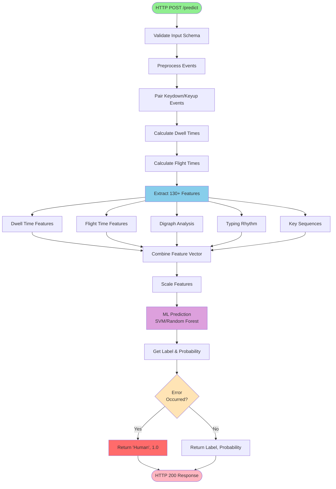

# uba-keyboard Service Documentation

## Table of Contents
1. [Description](#description)
2. [API Documentation](#api-documentation)
3. [Setup from Scratch](#setup-from-scratch)
4. [Dependencies](#dependencies)
5. [Configuration](#configuration)
6. [Deployment](#deployment)
7. [Process Flow](#process-flow)
8. [Database Interactions](#database-interactions)
9. [Additional Information](#additional-information)

---

## Description

- **Service Name:** `uba-keyboard`
- **Type:** ML Inference Service (Keystroke Dynamics Detection)
- **Language:** Python 3.12
- **Framework:** BentoML + scikit-learn
- **Port:** 3002 (configurable)

### Purpose

The uba-keyboard service is a specialized machine learning inference service that detects bot behavior by analyzing keystroke dynamics and typing patterns, with SVM/Random Forest classifiers, trained on keyboard timing features to distinguish between human and automated bot.

### Features

**Temporal Features:**
- **Dwell Time:** Duration a key is held down (keydown to keyup)
- **Flight Time:** Interval between releasing one key and pressing the next
- **Digraph Analysis:** Timing patterns for specific key pairs (e.g., "th", "er")
- **Typing Rhythm:** Variability and patterns in inter-keystroke timing

**Behavioral Patterns:**
- **Key Sequences:** Common typing patterns and transitions
- **Typing Speed:** Overall words per minute (WPM)
- **Pause Patterns:** Think time between words
- **Error Indicators:** Backspace usage and corrections

**Bot Detection Indicators:**
- Zero variance in dwell time (every key held same duration)
- Constant flight time between keys
- No typing errors or corrections
- Unnatural speed (too fast or perfectly regular)
- Missing natural rhythm variations

### Model Information

- **Algorithm:** SVM (Support Vector Machine) / Random Forest Classifier
- **Training Data:** Human vs. bot typing sessions
- **Features:** 130+ keystroke dynamics features per session
- **Performance:** ~90-93% accuracy on test set
- **Model Path:** `keyboard_bot_detector/checkpoints/`
- **Framework:** scikit-learn + BentoML

---

## API Documentation

> **Complete API Reference:** For detailed API documentation including request/response schemas, feature explanations, keystroke dynamics concepts, and code examples, see the **[OpenAPI Specification](../api/uba-keyboard-openapi.yaml)**

### Quick Reference

| Aspect             | Value                                                        |
| ------------------ | ------------------------------------------------------------ |
| **Port**           | 3002                                                         |
| **Protocol**       | HTTP REST                                                    |
| **Language**       | Python 3.12                                                  |
| **Framework**      | BentoML + scikit-learn                                       |
| **Model**          | SVM / Random Forest                                          |
| **Features**       | 130+ keystroke dynamics                                      |
| **Accuracy**       | ~90-93%                                                      |
| **Inference Time** | 20-80ms                                                      |
| **Workers**        | 4 (default)                                                  |
| **Database**       | None (stateless)                                             |
| **API Spec**       | [uba-keyboard-openapi.yaml](../api/uba-keyboard-openapi.yaml) |
**Base URL:**
- Development: `http://localhost:3002`
- Docker: `http://uba-keyboard:3002`

**Authentication:** None (internal service)
**Data Format:** JSON

### Endpoint Overview

#### POST /predict

Analyzes keyboard typing patterns to classify behavior as BOT or Human.

**Request:**
```json
{
  "data": [
    {
      "timestamp": 1234567890123,
      "button": "",
      "state": "keydown",
      "x": 0,
      "y": 0,
      "key": "h",
      "deltaY": 0
    },
    {
      "timestamp": 1234567890203,
      "button": "",
      "state": "keyup",
      "x": 0,
      "y": 0,
      "key": "h",
      "deltaY": 0
    }
  ]
}
```

**Response:**
```json
["BOT", 0.89]
```
Or:
```json
["Human", 0.91]
```

**Quick Test:**
```bash
curl -X POST http://localhost:3002/predict \
  -H "Content-Type: application/json" \
  -d '{
    "data": [
      {"timestamp": 1234567890, "button": "", "state": "keydown",
       "x": 0, "y": 0, "key": "a", "deltaY": 0},
      {"timestamp": 1234567890100, "button": "", "state": "keyup",
       "x": 0, "y": 0, "key": "a", "deltaY": 0}
    ]
  }'
```

### Key Data Structures

**Input Event Schema:**
```python
{
    "timestamp": int,      # Unix timestamp in milliseconds
    "button": str,         # Always "" for keyboard events
    "state": str,          # "keydown" or "keyup"
    "x": float,            # Cursor X coordinate (typically 0)
    "y": float,            # Cursor Y coordinate (typically 0)
    "key": str,            # Key pressed (e.g., "a", "Enter", "Backspace")
    "deltaY": float        # Always 0 for keyboard events
}
```

**Output Schema:**
```python
["BOT" | "Human", probability_score] # Tuple[str, float]
# Example: ("BOT", 0.89) or ("Human", 0.91)
```
### External Integrations

| Service | Purpose           | Protocol  |
| ------- | ----------------- | --------- |
| uba-api | Request gateway   | HTTP POST |
| None    | Stateless service | -         |

---
## Setup 

### Prerequisites

- Python 3.12 or higher
- pip or poetry package manager
- git (for cloning repository)
- **Docker:** Optional, for containerized deployment
- **Model Files:** Pre-trained models in checkpoints directory

### Step 1: Clone and Navigate to Directory

```bash
cd uba-keyboard
```

### Step 2: Install Dependencies

```bash
pip install -r requirements.txt
```

### Step 3: Verify Package Installation

```bash
python -c "from keystroke_bot_detector import KeyboardClassifier; print('Package loaded successfully')"
```

### Step 4: Create Environment File

Create `.env` file (optional):

```bash
WORKERS=12
```
### Step 5: Run Development Server

```bash
bentoml serve service:KeyboardBehaviorService --port 3002 --host 0.0.0.0
```

**Expected output:**
```
Starting BentoML HTTP server on http://0.0.0.0:3002
Service loaded: KeyboardBehaviorService
Workers: 12
```
### Step 6: Verify Server is Running

```bash
curl http://localhost:3002/healthz
```

### Step 7: Test Prediction Endpoint

```bash
curl -X POST http://localhost:3002/predict \
  -H "Content-Type: application/json" \
  -d '{
    "data": [
      {"timestamp": 1234567890, "button": "", "state": "keydown",
       "x": 0, "y": 0, "key": "h", "deltaY": 0},
      {"timestamp": 1234567890080, "button": "", "state": "keyup",
       "x": 0, "y": 0, "key": "h", "deltaY": 0},
      {"timestamp": 1234567890133, "button": "", "state": "keydown",
       "x": 0, "y": 0, "key": "e", "deltaY": 0},
      {"timestamp": 1234567890198, "button": "", "state": "keyup",
       "x": 0, "y": 0, "key": "e", "deltaY": 0}
    ]
  }'
```

Expected response:
```json
["Human", 0.XX]
```

---

## Dependencies

### Runtime Dependencies

| Package      | Version  | Purpose                                      |
| ------------ | -------- | -------------------------------------------- |
| bentoml      | >=1.2.0  | ML model serving framework                   |
| pandas       | >=2.0.0  | Data manipulation and feature extraction     |
| numpy        | >=1.24.0 | Numerical computations                       |
| scikit-learn | >=1.3.0  | Machine learning models (SVM, Random Forest) |
| pydantic     | >=2.0.0  | Data validation                              |
| xgboost      | latest   | Gradient boosting (optional model)           |
| mlflow       | latest   | Model tracking and versioning                |
| matplotlib   | latest   | Visualization for analysis                   |
| seaborn      | latest   | Statistical visualizations                   |
| hyperopt     | latest   | Hyperparameter tuning                        |

### Python Package Structure

```
keystroke_bot_detector/
├── __init__.py
├── keyboard_classifier.py    # Main KeyboardClassifier class
├── feature_extractor.py      # Feature engineering pipeline
├── preprocessing.py          # Event pairing and timing extraction
├── models.py                 # Model definitions
└── checkpoints/              # Trained model files
```

---

## Configuration

### Environment Variables

| Variable | Required | Default | Description |
|----------|----------|---------|-------------|
| `WORKERS` | No | `4` | Number of BentoML worker processes |
| `PORT` | No | `3002` | HTTP server port |
| `LOG_LEVEL` | No | `INFO` | Logging level (DEBUG, INFO, WARN, ERROR) |

### BentoML Service Configuration

**File:** `service.py`

```python
import bentoml
import os

@bentoml.service(
    workers=int(os.getenv("WORKERS", 4)),
    metrics={"enabled": False, "namespace": "bentoml_service"}
)
class KeyboardBehaviorService:
    def __init__(self):
        self.pipeline = KeyboardClassifier()
```

**Configuration Options:**
- `workers`: Number of parallel worker processes (default: 4)
- `metrics.enabled`: Enable Prometheus metrics (default: False)
- `metrics.namespace`: Metrics namespace prefix

### Model Configuration

Models are loaded from the `checkpoints/` directory at service startup:

```python
# Models loaded automatically
keystroke_bot_detector/checkpoints/
├── svm_model.pkl           # SVM classifier
├── rf_model.pkl            # Random Forest classifier
├── scaler.pkl              # Feature scaler
└── feature_columns.pkl     # Feature names
```

---

## Deployment

### Docker Deployment

#### Build Docker Image

```bash
docker build -t uba-keyboard:latest .
```

#### Run Container

```bash
docker run -d \
  --name uba-keyboard \
  -p 3002:3002 \
  -e WORKERS=4 \
  uba-keyboard:latest
```

#### View Logs

```bash
docker logs -f uba-keyboard
```

#### Stop Container

```bash
docker stop uba-keyboard
docker rm uba-keyboard
```

### Docker Compose

**File:** `docker-compose.yml`

```yaml
services:
  uba-keyboard:
    image: stormbird/uba-keyboard:latest
    container_name: uba-keyboard
    environment:
      - WORKERS=4
      - LOG_LEVEL=INFO
    command: bentoml serve service:KeyboardBehaviorService --port 3002 --host 0.0.0.0
    ports:
      - "3002:3002"
    networks:
      - uba-network
    restart: unless-stopped

networks:
  uba-network:
    driver: bridge
```

**Start service:**
```bash
docker-compose up -d uba-keyboard
```

**View logs:**
```bash
docker-compose logs -f uba-keyboard
```

**Stop service:**
```bash
docker-compose down
```

---

## Process Flow

### Activity Diagram - ML Inference Pipeline

This flowchart illustrates the complete keystroke analysis workflow from request to prediction.



---

### Data Flow Diagram - Service Interactions

This diagram shows how the uba-keyboard service integrates with the UBA ecosystem.

```mermaid
graph TB
    subgraph Client["Client Browser"]
        Browser[User Typing<br/>Keyboard Events]
    end

    subgraph Collector["client-collector :3000"]
        WS[WebSocket Server]
    end

    subgraph Gateway["uba-api :3001"]
        API[API Gateway]
        Router[Request Router]
    end

    subgraph MLServices["ML Inference Services"]
        subgraph KeyboardService["uba-keyboard :3002"]
            Endpoint[/predict Endpoint]
            Pipeline[Keyboard Pipeline]
            Preprocessor[Event Preprocessor]
            FeatureEngine[Feature Extractor]
            Model[SVM/RF Classifier]
        end

        Mouse[uba-mouse :3003]
        Scroll[uba-scroll :3004]
    end

    Browser -->|"1. Encrypted<br/>Keyboard Events"| WS
    WS -->|"2. Decrypt &<br/>Forward"| API
    API --> Router

    Router -->|"3. POST /predict<br/>{data: events}"| Endpoint
    Router -.->|"Parallel"| Mouse
    Router -.->|"Requests"| Scroll

    Endpoint --> Pipeline
    Pipeline --> Preprocessor
    Preprocessor -->|"Paired Events<br/>+ Timings"| FeatureEngine
    FeatureEngine -->|"130+ Features"| Model
    Model -->|"4. ['BOT', 0.89]"| Endpoint
    Endpoint -->|"5. Prediction"| Router
    Router -->|"6. Aggregated<br/>Response"| API
    API -->|"7. Result"| WS
    WS -->|"8. Response"| Browser

    style Browser fill:#E8F5E9
    style Endpoint fill:#BBDEFB
    style Model fill:#CE93D8
    style FeatureEngine fill:#FFE082
    style Preprocessor fill:#FFCCBC
```

1. **Request Reception**
   - BentoML receives HTTP POST to `/predict`
   - Validates request body against `DataframeSchema`
   - Converts JSON to pandas DataFrame

2. **Event Preprocessing** (`keyboard_classifier.py`)
   - Filter keyboard events (state: "keydown" or "keyup")
   - Pair keydown/keyup events for same key
   - Calculate dwell times: `keyup.timestamp - keydown.timestamp`
   - Calculate flight times: `next_keydown.timestamp - prev_keyup.timestamp`
   - Output: DataFrame with timing features

3. **Feature Extraction** (`feature_extractor.py`)
   - **Dwell Time Features:** Mean, std, percentiles (25th, 50th, 75th, 90th), min, max, CV
   - **Flight Time Features:** Inter-keystroke intervals, variance, autocorrelation
   - **Digraph Features:** Timing for common pairs ("th", "er", "in", "on", "at")
   - **Rhythm Features:** Typing speed (WPM), consistency, burst detection
   - **Sequence Features:** Key transition patterns, error indicators
   - **Temporal Features:** Pause detection, session duration
   - Output: Feature vector (130+ dimensions)

4. **Feature Scaling**
   - Apply StandardScaler (mean=0, std=1)
   - Uses pre-fitted scaler from training

5. **ML Prediction**
   - SVM or Random Forest classification
   - Predict class: 0 (Human) or 1 (BOT)
   - Extract probability score from `predict_proba()`
   - Convert to label string

6. **Response Formatting**
   - Convert class to label: "Human" or "BOT"
   - Return tuple: `(label, probability)`
   - JSON serialization: `["BOT", 0.89]`

7. **Error Handling**
   - Catch all exceptions
   - Log error details
   - Return safe default: `("Human", 1.0)`
   - Prevents false positives blocking legitimate users

---

## Database Interactions

> **Note.** The uba-keyboard service is a stateless ML inference service.

---

## Additional Information

### Error Handling

**Safe Default Strategy:**

The service implements fail-safe error handling to prevent false positives:

```python
@bentoml.api
async def predict(self, data: pd.DataFrame) -> Tuple[str, float]:
    try:
        preprocess_data = self.pipeline.preprocess(session=data)
        features = self.pipeline.extract_features(preprocess_data)
        label, prob = self.pipeline.predict(features)
        return (label, prob)
    except Exception as e:
        logger.error(e)
        logger.error(f"Keyboard would return Human by default")
        return ("Human", 1.0)
```

### Logging

**Log Levels:**
- `INFO`: Service startup, model loading, prediction statistics
- `WARN`: Unusual patterns, edge cases
- `ERROR`: Feature extraction failures, model errors

**Example Logs:**
```
INFO: KeyboardBehaviorService initialized with 4 workers
INFO: Loaded SVM model from checkpoints/svm_model.pkl
INFO: Processing keyboard session with 45 keystroke events
INFO: Prediction: Human (0.78 confidence)
ERROR: Feature extraction failed: IndexError - insufficient keydown/keyup pairs
ERROR: Keyboard would return Human by default
```

### Synthetic Bot Generation

For testing and model training, synthetic bot data can be generated:

```python
from keystroke_bot_detector.bot_generator.static_bot import generate_static_typing

# Generate bot keystrokes with constant timing
bot_events = generate_static_typing(
    text="hello world",
    dwell_time=50,      # Fixed 50ms hold time
    flight_time=100     # Fixed 100ms between keys
)

# Generate human-like typing with variability
from keystroke_bot_detector.bot_generator.human_bot import generate_human_typing

human_events = generate_human_typing(
    text="hello world",
    mean_dwell=80,      # Mean 80ms, with variance
    mean_flight=120     # Mean 120ms, with variance
)
```

### Troubleshooting

**Issue: Service returns "Human" for all requests**

```bash
# Check model files exist
ls -la keystroke_bot_detector/checkpoints/

# Verify model loading
python -c "from keystroke_bot_detector import KeyboardClassifier; kc = KeyboardClassifier(); print('OK')"
```

**Issue: Insufficient keyboard events error**

- Ensure at least 2 keydown/keyup pairs in request
- Minimum data: 
	```json
	[{state: "keydown", key: "a", ...}, {state: "keyup", key: "a", ...}]
	```

**Issue: Feature extraction fails**
- Verify keydown/keyup pairing
- Each keydown must have corresponding keyup with same key value
- Check that "key" field is populated and not null

**Issue: High false positive rate**
- May need model retraining with more diverse data
- Check if user typing patterns are significantly different from training data
- Adjust decision threshold


---

**Last Updated:** 2025-12-11