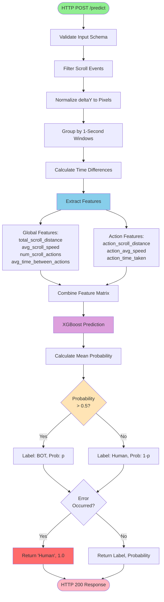

# uba-scroll Service Documentation

## Table of Contents
1. [Description](#description)
2. [API Documentation](#api-documentation)
3. [Setup from Scratch](#setup-from-scratch)
4. [Dependencies](#dependencies)
5. [Configuration](#configuration)
6. [Deployment](#deployment)
7. [Process Flow](#process-flow)
8. [Database Interactions](#database-interactions)
9. [Additional Information](#additional-information)

---

## Description

- **Service Name:** `uba-scroll`
- **Type:** ML Inference Service (Scroll Behavior Detection)
- **Language:** Python 3.12
- **Framework:** BentoML + XGBoost
- **Port:** 3004 (configurable)

### Purpose

The `uba-scroll` service  detects bot behavior by analyzing scroll patterns and dynamics using an XGBoost model trained on scroll behavior features to distinguish between human and automated scrolling.

### Features

**Temporal Grouping:**
- **Action Sequences:** Analyzes patterns across multiple scroll actions
- **Time Intervals:** Measures pauses and transitions between scroll actions

**Behavioral Features:**
- **Scroll Distance:** Total and per-action scroll distances (deltaY values)
- **Scroll Speed:** Average scrolling velocity and speed variations
- **Action Count:** Number of distinct scroll actions in session
- **Timing Patterns:** Time distribution between scroll events

**Bot Detection Indicators:**
- Constant scroll speed across all actions
- Uniform scroll distances (every scroll same deltaY)
- No natural variations or pauses
- Perfect timing intervals between scrolls
- Missing human-like irregularities (hesitations, corrections)

### Model Information

- **Algorithm:** XGBoost (Gradient Boosting) Classifier
- **Training Data:** Human vs. bot scrolling sessions
- **Features:** Global metrics + per-action statistics
- **Performance:** ~85-90% accuracy on test set
- **Model Path:** `scroll_bot_detector/checkpoints/xgboost/15_6/dev/`
- **Framework:** XGBoost 3.0 + BentoML

---

## API Documentation

> **Complete API Reference:** For detailed API documentation including request/response schemas, feature explanations, scroll dynamics concepts, and code examples, see the **[OpenAPI Specification](../api/uba-scroll-openapi.yaml)**

### Quick Reference

| Aspect             | Value                                                    |
| ------------------ | -------------------------------------------------------- |
| **Port**           | 3004                                                     |
| **Protocol**       | HTTP REST                                                |
| **Language**       | Python 3.12                                              |
| **Framework**      | BentoML + XGBoost                                        |
| **Model**          | XGBoost Gradient Boosting                                |
| **Features**       | 7 (4 global + 3 per-action)                              |
| **Accuracy**       | ~85-90%                                                  |
| **Inference Time** | 15-60ms                                                  |
| **Workers**        | 4 (default)                                              |
| **Database**       | None (stateless)                                         |
| **API Spec**       | [uba-scroll-openapi.yaml](../api/uba-scroll-openapi.yaml) |

**Base URL:**
- Development: `http://localhost:3004`
- Docker: `http://uba-scroll:3004`

**Authentication:** None (internal service)
**Data Format:** JSON

### Endpoint Overview

#### POST /predict

Analyzes scroll patterns to classify behavior as BOT or Human.

**Request:**
```json
{
  "data": [
    {
      "timestamp": 1234567890100,
      "button": "scroll",
      "state": "move",
      "x": 500,
      "y": 300,
      "key": "",
      "deltaY": -120
    },
    {
      "timestamp": 1234567890150,
      "button": "scroll",
      "state": "move",
      "x": 500,
      "y": 400,
      "key": "",
      "deltaY": -100
    }
  ]
}
```

**Response:**
```json
["BOT", 0.85]
```
Or:
```json
["Human", 0.92]
```

**Quick Test:**
```bash
curl -X POST http://localhost:3004/predict \
  -H "Content-Type: application/json" \
  -d '{
    "data": [
      {"timestamp": 1234567890, "button": "scroll", "state": "move",
       "x": 500, "y": 300, "key": "", "deltaY": -120},
      {"timestamp": 1234567890100, "button": "scroll", "state": "move",
       "x": 500, "y": 400, "key": "", "deltaY": -100}
    ]
  }'
```

### Key Data Structures

**Input Event Schema:**
```python
{
    "timestamp": int,      # Unix timestamp in milliseconds
    "button": str,         # "scroll" for scroll events
    "state": str,          # "move" for scroll
    "x": float,            # Mouse X coordinate during scroll
    "y": float,            # Mouse Y coordinate during scroll
    "key": str,            # Always "" for scroll events
    "deltaY": float        # Scroll delta in pixels (negative = up, positive = down)
}
```

**Output Schema:**
```python
Tuple[str, float]
# ["BOT" | "Human", probability_score]
# Example: ("BOT", 0.85) or ("Human", 0.92)
```

### Feature Categories

The service extracts features across 2 main categories:

**1. Session-based Features (4 features):**
- `total_scroll_distance`: Total distance scrolled in session
- `avg_scroll_speed`: Average scrolling velocity
- `num_scroll_actions`: Number of distinct 1-second scroll actions
- `avg_time_between_actions`: Average interval between actions

**2. Action-based Features (per 1-second window, 3 features):**
- `action_scroll_distance`: Distance scrolled in action
- `action_avg_speed`: Average speed during action
- `action_time_taken`: Duration of scroll action

### External Integrations

| Service | Purpose           | Protocol  |
| ------- | ----------------- | --------- |
| uba-api | Request gateway   | HTTP POST |

---

## Setup 

### Prerequisites

- Python 3.12 or higher
- pip or poetry package manager
- git (for cloning repository)
- **Docker:** Optional, for containerized deployment
- **Model Files:** Pre-trained models in checkpoints directory

### Step 1: Navigate to Service Directory

```bash
cd uba-scroll
```

### Step 2: Install Dependencies

```bash
pip install -r requirements.txt
```

### Step 3: Verify Package Installation

```bash
python -c "from scroll_bot_detector import ScrollClassifier; print('Package loaded successfully')"
```

### Step 4: Run Development Server

```bash
bentoml serve service:ScrollService --port 3004 --host 0.0.0.0
```

### Step 5: Verify Server is Running

```bash
curl http://localhost:3004/healthz
```

### Step 6: Test Prediction Endpoint

```bash
curl -X POST http://localhost:3004/predict \
  -H "Content-Type: application/json" \
  -d '{
    "data": [
      {"timestamp": 1234567890, "button": "scroll", "state": "move",
       "x": 500, "y": 300, "key": "", "deltaY": -120},
      {"timestamp": 1234567890100, "button": "scroll", "state": "move",
       "x": 500, "y": 400, "key": "", "deltaY": -100},
      {"timestamp": 1234567890200, "button": "scroll", "state": "move",
       "x": 500, "y": 500, "key": "", "deltaY": -95}
    ]
  }'
```

Expected response:
```json
["Human", 0.XX]
```

---

## Dependencies

### Runtime Dependencies

| Package | Version | Purpose |
|---------|---------|---------|
| bentoml | latest | ML model serving framework |
| pandas | ==2.2.3 | Data manipulation and feature extraction |
| numpy | ==2.0.2 | Numerical computations |
| xgboost | ==3.0.0 | Gradient boosting model |
| scikit-learn | ==1.6.1 | ML utilities and preprocessing |
| pydantic | ==2.10.6 | Data validation |
| scipy | ==1.13.1 | Scientific computing |
| python-dotenv | latest | Environment variable management |
| seaborn | latest | Statistical visualizations |
| mlflow | latest | Model tracking and versioning |
| ipykernel | latest | Jupyter notebook support |
| hyperopt | latest | Hyperparameter tuning |

### Python Package Structure

```
scroll_bot_detector/
├── __init__.py
├── scroll_classifier.py      # Main ScrollClassifier class
├── feature_extractor.py      # Feature engineering pipeline
├── models.py                  # Data validation models
├── core/
│   └── model.py               # XGBoost wrapper class
└── checkpoints/
    └── xgboost/
        └── 15_6/
            └── dev/           # Trained model files
```


---

## Configuration

### Environment Variables

| Variable | Required | Default | Description |
|----------|----------|---------|-------------|
| `WORKERS` | No | `4` | Number of BentoML worker processes |
| `PORT` | No | `3004` | HTTP server port |
| `LOG_LEVEL` | No | `INFO` | Logging level (DEBUG, INFO, WARN, ERROR) |
| `WINDOW_HEIGHT` | No | `1080` | Window height for deltaY normalization |

### BentoML Service Configuration

**File:** `service.py`

```python
import bentoml
import os

@bentoml.service(
    workers=int(os.getenv("WORKERS", default=4)),
    metrics={
        "enabled": False,
        "namespace": "bentoml_service"
    }
)
class ScrollService:
    def __init__(self):
        self.pipeline = ScrollClassifier()
```

**Configuration Options:**
- `workers`: Number of parallel worker processes (default: 4)
- `metrics.enabled`: Enable Prometheus metrics (default: False)
- `metrics.namespace`: Metrics namespace prefix

### Model Configuration

Models are loaded from the `checkpoints/` directory at service startup:

```python
# Model loaded automatically from
scroll_bot_detector/checkpoints/xgboost/15_6/dev/
├── model files (XGBoost artifacts)
```

---

## Deployment

### Docker Deployment

#### Build Docker Image

```bash
docker build -t uba-scroll:latest .
```

#### Run Container

```bash
docker run -d \
  --name uba-scroll \
  -p 3004:3004 \
  -e WORKERS=4 \
  uba-scroll:latest
```

#### View Logs

```bash
docker logs -f uba-scroll
```

#### Stop Container

```bash
docker stop uba-scroll
docker rm uba-scroll
```

### Docker Compose

**File:** `docker-compose.yml`

```yaml
services:
  uba-scroll:
    image: stormbird/uba-scroll:latest
    container_name: uba-scroll
    environment:
      - WORKERS=4
      - LOG_LEVEL=INFO
    command: bentoml serve service:ScrollService --port 3004 --host 0.0.0.0
    ports:
      - "3004:3004"
    networks:
      - uba-network
    restart: unless-stopped

networks:
  uba-network:
    driver: bridge
```

**Start service:**
```bash
docker-compose up -d uba-scroll
```

**View logs:**
```bash
docker-compose logs -f uba-scroll
```

**Stop service:**
```bash
docker-compose down
```

### Kubernetes Deployment

```yaml
apiVersion: apps/v1
kind: Deployment
metadata:
  name: uba-scroll
spec:
  replicas: 2
  selector:
    matchLabels:
      app: uba-scroll
  template:
    metadata:
      labels:
        app: uba-scroll
    spec:
      containers:
      - name: uba-scroll
        image: uba-scroll:latest
        ports:
        - containerPort: 3004
        env:
        - name: WORKERS
          value: "4"
        resources:
          requests:
            memory: "512Mi"
            cpu: "500m"
          limits:
            memory: "1Gi"
            cpu: "1000m"
---
apiVersion: v1
kind: Service
metadata:
  name: uba-scroll
spec:
  selector:
    app: uba-scroll
  ports:
  - port: 3004
    targetPort: 3004
  type: ClusterIP
```

---

## Process Flow

### Activity Diagram - ML Inference Pipeline

This flowchart illustrates the complete scroll analysis workflow from request to prediction.



---

### Data Flow Diagram - Service Interactions

This diagram shows how the uba-scroll service integrates with the UBA ecosystem.

```mermaid
graph TB
    subgraph Client["Client Browser"]
        Browser[User Scrolling<br/>Scroll Events]
    end

    subgraph Collector["client-collector :3000"]
        WS[WebSocket Server]
    end

    subgraph Gateway["uba-api :3001"]
        API[API Gateway]
        Router[Request Router]
    end

    subgraph MLServices["ML Inference Services"]
        Mouse[uba-mouse :3003]
        Keyboard[uba-keyboard :3002]

        subgraph ScrollService["uba-scroll :3004"]
            Endpoint[/predict Endpoint]
            Pipeline[Scroll Pipeline]
            Filter[Event Filter]
            Grouper[Action Grouper]
            FeatureEngine[Feature Extractor]
            Model[XGBoost Classifier]
        end
    end

    Browser -->|"1. Encrypted<br/>Scroll Events"| WS
    WS -->|"2. Decrypt &<br/>Forward"| API
    API --> Router

    Router -.->|"Parallel"| Mouse
    Router -.->|"Requests"| Keyboard
    Router -->|"3. POST /predict<br/>{data: events}"| Endpoint

    Endpoint --> Pipeline
    Pipeline --> Filter
    Filter -->|"Scroll Events<br/>Only"| Grouper
    Grouper -->|"1-Second<br/>Actions"| FeatureEngine
    FeatureEngine -->|"Global + Action<br/>Features"| Model
    Model -->|"4. ['BOT', 0.85]"| Endpoint
    Endpoint -->|"5. Prediction"| Router
    Router -->|"6. Aggregated<br/>Response"| API
    API -->|"7. Result"| WS
    WS -->|"8. Response"| Browser

    style Browser fill:#E8F5E9
    style Endpoint fill:#BBDEFB
    style Model fill:#CE93D8
    style FeatureEngine fill:#FFE082
    style Grouper fill:#FFCCBC
```

---

### Detailed Step-by-Step Process

**Location:** `service.py:26-40`, `scroll_classifier.py`, `feature_extractor.py`

1. **Request Reception**
   - BentoML receives HTTP POST to `/predict`
   - Validates request body against `DataframeSchema`
   - Converts JSON to pandas DataFrame

2. **Event Preprocessing** (`feature_extractor.py:8-25`)
   - **Validation:** Validate events against RawData schema
   - **Sorting:** Sort events by timestamp
   - **Time Diff:** Calculate time difference between consecutive events
   - **Filtering:** Filter only scroll events (button == "scroll")
   - **Normalization:** Convert deltaY to pixels if needed (multiply by WINDOW_HEIGHT if values < 1)
   - **Action Grouping:** Group scroll events by 1-second windows (scroll_timediff > 1000ms)
   - Output: Grouped scroll events with action_id

1. **Feature Extraction** (`feature_extractor.py:27-100`)
   **Global Features:**
   - `total_scroll_distance`: Sum of all deltaY values
   - `avg_scroll_speed`: Average deltaY / average time_diff
   - `num_scroll_actions`: Count of unique action_ids
   - `avg_time_between_actions`: Mean duration per action
   **Per-Action Features:**
   - `action_scroll_distance`: Sum of deltaY per action_id
   - `action_avg_speed`: Mean deltaY / mean time_diff per action
   - `action_time_taken`: Max timestamp - Min timestamp per action
   -> Output: DataFrame with 7 features per action row

4. **ML Prediction** (`scroll_classifier.py:38-58`)
   - XGBoost model inference on feature matrix
   - Calculate probability for each action row
   - Compute mean probability across all actions
   - Threshold at 0.5: > 0.5 = BOT, <= 0.5 = Human
   - Return appropriate label and probability

5. **Response Formatting**
   - Convert prediction to tuple: `(label, probability)`
   - JSON serialization: `["BOT", 0.85]` or `["Human", 0.92]`

6. **Error Handling**
   - Catch all exceptions
   - Log error details
   - Return safe default: `("Human", 1.0)`
   - Prevents false positives blocking legitimate users

---

## Database Interactions

> **None.** The uba-scroll service is a stateless ML inference service.

### Data Persistence

Models and artifacts are loaded at startup from the filesystem:

```
scroll_bot_detector/checkpoints/xgboost/15_6/dev/
├── XGBoost model files (binary artifacts)
```


---

## Additional Information

### Error Handling

**Safe Default Strategy:**

The service implements fail-safe error handling to prevent false positives:

```python
@bentoml.api
async def predict(self, data: pd.DataFrame) -> Tuple[str, float]:
    try:
        preprocess_data = self.pipeline.preprocess(session=data)
        features = self.pipeline.extract_features(preprocess_data)
        label, prob = self.pipeline.predict(features)
        return (label, prob)
    except Exception as e:
        logger.error(e)
        return ("Human", 1.0)
```

### Performance Metrics

| Metric | Value |
|--------|-------|
| **Inference Time** | 15-60ms per request |
| **Throughput** | 150-600 requests/second (per worker) |
| **Memory Usage** | ~250-400MB per worker |
| **CPU Usage** | Medium (action grouping intensive) |
| **Model Size** | ~5-10MB (loaded in memory) |
| **Accuracy** | ~85-90% on test set |
| **False Positive Rate** | <10% |
| **False Negative Rate** | <12% |
### Logging

**Log Levels:**
- `INFO`: Service startup, model loading, prediction statistics
- `WARN`: Unusual patterns, edge cases
- `ERROR`: Feature extraction failures, model errors

**Example Logs:**
```
INFO: ScrollService initialized with 4 workers
INFO: Loaded XGBoost model from checkpoints/xgboost/15_6/dev
INFO: Processing scroll session with 25 scroll events, 5 actions
INFO: Prediction: Human (0.82 confidence)
ERROR: Feature extraction failed: Empty DataFrame after filtering scroll events
ERROR: Scroll would return Human by default
```

### Troubleshooting

**Issue: Service returns "Human" for all requests**

```bash
# Check model files exist
ls -la scroll_bot_detector/checkpoints/xgboost/15_6/dev/

# Verify model loading
python -c "from scroll_bot_detector import ScrollClassifier; sc = ScrollClassifier(); print('OK')"
```

**Issue: No scroll events detected**
- Ensure events have button == "scroll"
- Verify scroll events in request data
- Minimum data: 1+ scroll events

**Issue: Feature extraction fails**
- Check that deltaY values are populated
- Verify timestamp ordering (should be chronological)
- Ensure at least 1 scroll event exists

**Issue: deltaY normalization incorrect**
- If deltaY values are decimals (0.0 to 1.0), they'll be multiplied by WINDOW_HEIGHT (1080)
- If already in pixels, no multiplication occurs
- Check `WINDOW_HEIGHT` environment variable if needed

---

**Last Updated:** 2025-12-11
